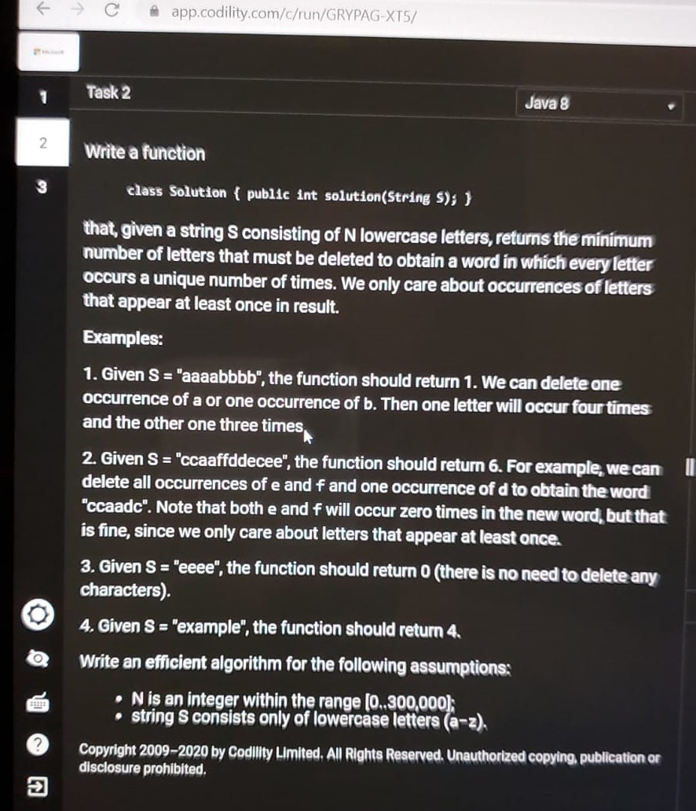

# Questions
## Online Assessment
- ### Concatenated String Length with unique Characters
https://leetcode.com/discuss/interview-question/401826/

Given an Array A consisting of N Strings, calculate the length of the longest string S such that:

    S is a concatenation of some of the Strings from A.
    every letter in S is different.

Example

    A = ["co","dil","ity"] , function should return 5, resulting string S could be codil , dilco, coity,ityco
    A = ["abc","kkk","def","csv"] , returns 6 , resulting Strings S could be abcdef , defabc, defcsv , csvdef
    A = ["abc","ade","akl"] , return 0 , impossible to concatenate as letters wont be unique.

N is [1..8] ; A consists of lowercase English letters ; sum of length of strings in A does not exceed 100.

Related problems:

https://leetcode.com/problems/maximum-length-of-a-concatenated-string-with-unique-characters/

#### [Solution](OnlineAssesment/ConcatenatedStringLengthWithUniqueCharacters.java)

- ### Min Deletions to Make Frequency of Each Letter Unique

Given a string s consisting of n lowercase letters, you have to delete the minimum number of characters from s so that every letter in s appears a unique number of times. We only care about the occurrences of letters that appear at least once in result.

Example 1:

    Input: "eeeeffff"
    Output: 1
Explanation:
We can delete one occurence of 'e' or one occurence of 'f'. Then one letter will occur four times and the other three times.

Example 2:

    Input: "aabbffddeaee"
    Output: 6
Explanation:
For example, we can delete all occurences of 'e' and 'f' and one occurence of 'd' to obtain the word "aabbda".
Note that both 'e' and 'f' will occur zero times in the new word, but that's fine, since we only care about the letter that appear at least once.

Example 3:

    Input: "llll"
    Output: 0
Explanation:
There is no need to delete any character.

Example 4:

    Input: "example"
    Output: 4

#### [Solution](OnlineAssesment/MinimumDeletionsRequiredToMakeFrequencyOfEachLetterUnique.java)

- ### Min Adj Swaps to Group Red Balls

https://leetcode.com/discuss/interview-question/414660/

Example:

    Input: "RRRWRR"
    Output: 2

Related problems:

[Minimum swaps need to make K girls sitting together](https://leetcode.com/discuss/interview-question/125154/ "")

#### [Solution](OnlineAssesment/MinAdjSwapsToGroupRedBalls.java)